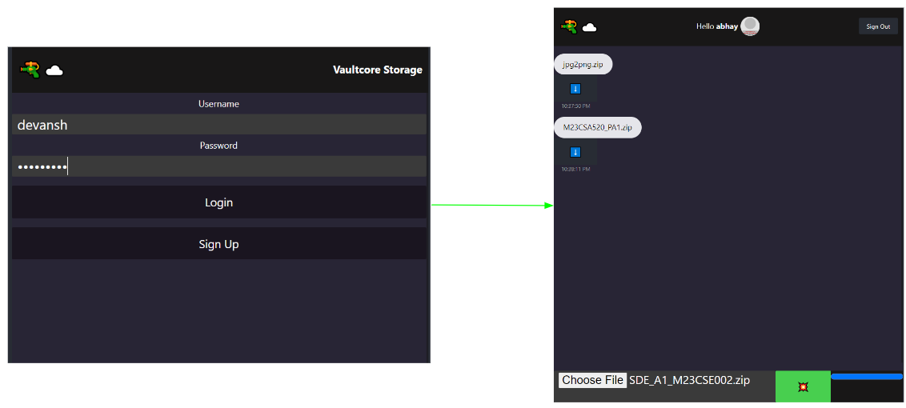
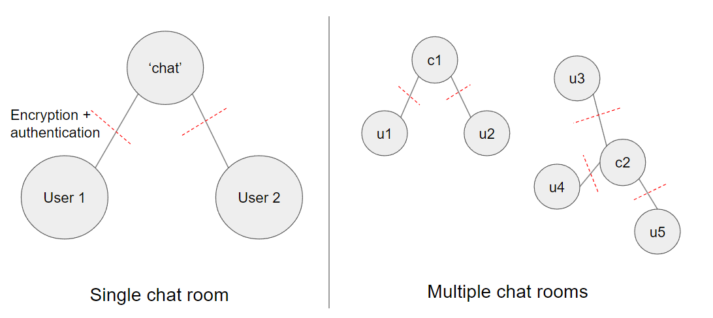
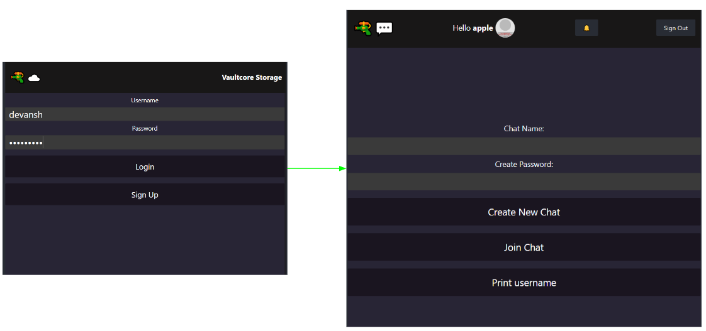

# GUN File Chat Demo

A decentralized file chat app built with [GUN](https://gun.eco/). 

A further variation of <a href = "https://github.com/fireship-io/gun-chat/tree/main">Fireship's Gun Chat</a>

Code Logic:
- Use IPFS to get hash
- store that hash after Gun's SEA in messages.

```
git clone <this-repo>
npm install
npm run dev
```




### Compile to APK
```
npm install @capacitor/core @capacitor/cli @capacitor/android
npx cap init
npm run build
npx cap add android
npx cap open android
```

You can also add the functionality to create multiple chats as 'chat rooms' and share them to other users. Will add that code for reference here too. 






### Future Scope
- improve rudimentary frontend
- add images
